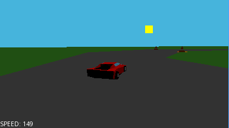

# prizm_racing
A 3D, multiplayer racing game for casio fx-CG50 calculators

## Pictures

## Features
- 3D graphics
- Simple multiplayer (just connect two calculators)
- Runs at about 16 FPS normally and 21 FPS overclocked, on the fx-CG50.

## Controls
- Press `up`/`8` to accelerate and `down`/`5` to brake
- Press `left`/`4` and `right`/`6` to turn
- Press `menu` to exit
- If you return from the menu, press any key to continue playing
- **Tip**: if you use `left` and `right` to turn and `8` to accelerate, you can turn while accelerating

## How to install
- Download the zip file from the releases page and extract it to get the `.g3a` file.
- Connect the calculator via USB and choose the `USB Flash` option (`F1`)
- Copy the file to the calculator.

## Notes/Bugs
- In multiplayer, each player sees the other car behind where it really is, so it's possible that both players see themselves finish first.
- For multiplayer to work, both calculators must be running at the same frequency (if you overclock one, you must overclock both).
- The car's movement isn't totally independent from framerate, so it may be a bit more or less slippery if you're overclocking, underclocking, or using another calculator.
- This game also works on casio fx-CG20 calculators, but it's too slow (at least without overclocking).
- Running this game might cause file transfer to stop working. To fix this, reset the calculator by pressing the button on the back or removing and re-inserting a battery. This doesn't delete any files.
- If you connect the cable while one calculator is in the menu, it might start trying to receive files. To avoid this, only connect the cable while the game is running on both calculators.

## How to build
### prizm sdk version (with multiplayer)
This version supports multiplayer, but it's slower than the gint version.
#### Linux
- Set up the Prizm SDK ([PrizmSDK Setup Guide](https://prizm.cemetech.net/index.php/PrizmSDK_Setup_Guide))
- Set the FXCGSDK environment variable to where you installed libfxcg (`export FXCGSDK=...`), or put the prizm_racing directory in `libfxcg/projects/prizm_racing`.
- Run `make prizm`
#### Windows (pirzm sdk version)
- Download the Prizm SDK ([https://github.com/Jonimoose/libfxcg/releases](https://github.com/Jonimoose/libfxcg/releases))
- Make sure the path to the SDK doesn't contain any spaces
- Put the `prizm_racing` directory in `PrizmSDK/projects/prizm_racing`
- Run `..\..\bin\make.exe prizm`

### gint version (singleplayer only)
This version doesn't support multiplayer, but it runs faster and doesn't have a border.
#### Linux
- Install gint ([https://gitea.planet-casio.com/Lephenixnoir/gint](https://gitea.planet-casio.com/Lephenixnoir/gint))
- Run `make gint`

## Technical information
### 3D rendering
- All the rendering code is in `src/rasterizer.h` and `src/rasterizer.cpp`
- Every triangle is clipped to avoid drawing triangles outside the screen. If a triangle is only partially inside the screen, it's cut in one or two triangles. This doesn't happen with the cones and the car to improve performance.
- The triangles are rasterized using the scan line algorithm with a depth buffer.
- This renderer only supports diffuse directional lighting, because this way there is only one color per triangle, which increases performance.
- Because the calculator doesn't have a floating point unit (FPU), everything related to rendering uses fixed point numbers (defined in src/fp.h). This caused some issues related to precision, most of which were solved by checking where the floating point calculations were overflowing.
- To improve performance, the cones that are too far away from the camera are replaced with a simpler model and the ones even further away aren't drawn at all.

#### Potential rendering performance improvements
- Use DMA to clear the screen and draw the grass (in progress)
- Clip models before clipping triangles

### Multiplayer
All of the multiplayer code is in `src/main.cpp`
- When the game starts, a second car is created outside the track.
- Every frame, each calculator sends its `car` data (position, direction, etc.) to the other one over the 3-pin cable
- If the calculators are connected, the other one receives the data and updates its `enemyCar`.
- Otherwise, the enemy car doesn't move, and stays outside the track.
- To synchronize the byte stream, each byte of data sent is in this format: 0 0 0 X A B C D, where X is 1 if it's the first byte sent in a frame, and A B C D are four bits of car data.

#### Lag
Improving this would be possible by synchronizing both calculator's clocks to measure the delay, and then trying to predict where the other car will be that time in the future, but I think it's better to keep the multiplayer simple.
