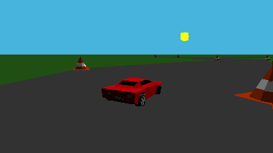

# prizm_racing
A 3D, multiplayer racing game for casio fx-CG 10/20/50 calculators

## Pictures
  
Now with textures since version 1.4:

## Features
- 3D graphics
- Simple multiplayer (just connect two calculators)
- Runs at about 18 FPS

## Controls
- Press `up`/`8` to accelerate and `down`/`5` to brake
- Press `left`/`4` and `right`/`6` to turn
- Press `menu` to exit
- If you return from the menu, press any key to continue playing
- **Tip**: if you use `left` and `right` to turn and `8` to accelerate, you can turn while accelerating

## How to install
- Download the zip file from the releases page and extract it to get the `.g3a` file.
- Connect the calculator via USB and choose the `USB Flash` option (`F1`)
- Copy the file to the calculator.

## Notes/Bugs
- In multiplayer, each player sees the other car behind where it really is, so it's possible that both players see themselves finish first.
- The car's movement isn't totally independent from framerate, so it may be a bit more or less slippery if you're overclocking, underclocking, or using a different calculator.
- If you connect the cable while one calculator is in the menu, it might start trying to receive files. To avoid this, only connect the cable while the game is running on both calculators.

## Links
- [Cemetech forum post](https://www.cemetech.net/forum/viewtopic.php?t=18915)
- [Cemetech archive](http://ceme.tech/DL2319)

## How to build
### prizm sdk version (with multiplayer support)
#### Linux
- Set up the Prizm SDK ([PrizmSDK Setup Guide](https://prizm.cemetech.net/Tutorials/PrizmSDK_Setup_Guide/))
- Set the FXCGSDK environment variable to where you installed libfxcg (`export FXCGSDK=...`), or put the prizm_racing directory in `libfxcg/projects/prizm_racing`.
- Run `make prizm`
#### Windows
- Download the Prizm SDK ([https://github.com/Jonimoose/libfxcg/releases](https://github.com/Jonimoose/libfxcg/releases))
- Make sure the path to the SDK doesn't contain any spaces
- Put the `prizm_racing` directory in `PrizmSDK/projects/prizm_racing`
- Run `..\..\bin\make.exe prizm`

### gint version (singleplayer only)
This version doesn't support multiplayer yet, but it doesn't have a border.
#### Linux
- Install gint ([https://gitea.planet-casio.com/Lephenixnoir/gint](https://gitea.planet-casio.com/Lephenixnoir/gint))
- Install libprof ([https://gitea.planet-casio.com/Lephenixnoir/libprof](https://gitea.planet-casio.com/Lephenixnoir/libprof))
- Run `make gint`

## Technical information
### 3D rendering
- All the rendering code is in `src/rasterizer.h`, `src/rasterizer.cpp` and `src/drawTriangle.h`
- Every triangle is clipped to avoid drawing triangles outside the screen. If a triangle is only partially inside the screen, it's cut in one or two triangles. This doesn't happen with the cones and the car to improve performance.
- Because the calculator doesn't have a floating point unit (FPU), everything related to rendering uses fixed point numbers (defined in src/fp.h). This caused some issues related to precision, most of which were solved by checking where the floating point calculations were overflowing.
- To improve performance, the cones that are too far away from the camera aren't drawn.

#### Triangle rasterization (in `src/drawTriangle.h`)
- The triangles are rasterized using a scan-line algorithm.
- An (untextured) triangle only has one color, as doing lighting calculations per pixel would be too slow. However, it would be possible to calculate lighting per vertex and then linearly interpolate the color over the triangle.
- For texturing, we calculate the initial texture coordinate and how much it changes for each pixel, horizontally and vertically. This results in a linear approximation of the texture coordinates, which is not perspective-correct, so it doesn't work well for larger surfaces.

### Multiplayer
All of the multiplayer code is in `src/main.cpp`
- When the game starts, a second car is created outside the track.
- Every frame, each calculator sends its `car` data (position, direction, etc.) to the other one over the 3-pin cable
- If the calculators are connected, the other one receives the data and updates its `enemyCar`.
- Otherwise, the enemy car doesn't move, and stays outside the track.
- To synchronize the byte stream, each byte of data sent is in this format: 0 0 0 X A B C D, where X is 1 if it's the first byte sent in a frame, and A B C D are four bits of car data.

#### Lag
Improving this would be possible by synchronizing both calculator's clocks to measure the delay, and then trying to predict where the other car will be that time in the future, but I think it's better to keep the multiplayer simple.
